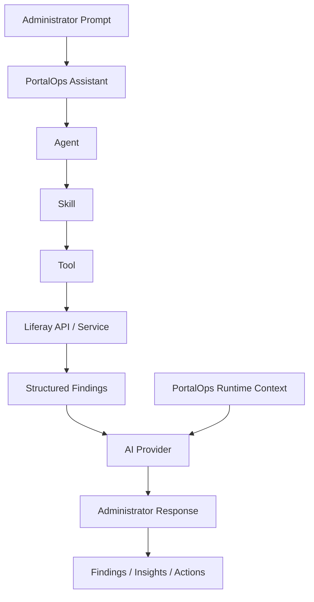

# PortalOps

PortalOps is an AI-assisted operations console for Liferay administrators.

It collects live operational data from Liferay, passes structured findings to an
AI provider, and returns administrator-focused responses, findings, insights,
and recommended follow-up actions.

This repository is currently Liferay-first and built as a native Liferay
`portal-7.4-ga132` modular workspace.

## Vision

PortalOps is not meant to be a generic chatbot and not a thin wrapper around
Liferay services.

The product vision is:

```text
PortalOps collects operational facts from Liferay
and AI turns those facts into useful administrative responses.
```

That means:

- PortalOps is responsible for data collection, execution, security, and
  Liferay integration.
- AI is responsible for explanation, summarization, interpretation, and
  recommendations.
- The assistant is the primary interaction model.
- The dashboard, findings, actions, and insights are supporting operational
  views around the conversation.

## Core Model

```text
Prompt -> Agent -> Skill -> Tool -> Liferay -> Structured Data -> AI -> Response
```

PortalOps is designed to feel like an operations assistant for administrators,
not a developer console, not a REST client, and not a static admin dashboard.

## What PortalOps Is

PortalOps is:

- An administrator-focused AI operations console
- A modular Liferay application built from domain bundles and agent bundles
- A structured runtime that separates data collection from response generation
- A system that prefers counts, summaries, health indicators, risks, and
  operational insights over unnecessary raw data exposure

PortalOps is not:

- A generic AI chatbot
- A Java service that hardcodes English responses
- A dashboard-only product
- A monolithic admin application

## Architecture

PortalOps follows a layered execution model:

```text
PortalOps Assistant
    ↓
Agent
    ↓
Skill
    ↓
Tool
    ↓
Liferay API / Service
    ↓
Structured Findings
    ↓
AI Provider
    ↓
Administrator-Facing Response
```

Important rules:

- Agents, Skills, and Tools do not generate final English prose.
- They return structured operational data only.
- AI providers receive:
  - the user prompt
  - PortalOps runtime metadata
  - execution metadata
  - structured findings
- AI generates the final response using PortalOps runtime context as the source
  of truth.



## Bundle Model

PortalOps is moving toward a consistent bundle naming model:

- `portalops-agent-<domain>`
  Agent, skills, tools, execution DTOs, runtime metadata
- `portalops-<domain>`
  Shared domain inspection and Liferay-facing services
- `portalops-assistant-service`
  Prompt routing, runtime context injection, AI provider handoff
- `portalops-web`
  Conversation UI, findings, insights, actions, dashboard rendering

Current examples:

- `portalops-agent-user`
- `portalops-agent-site`
- `portalops-agent-content`
- `portalops-agent-search`
- `portalops-agent-management`
- `portalops-site`
- `portalops-content`
- `portalops-search`

## Current Status

Implemented MVP domains:

- Users
- Sites
- Content
- Search
- PortalOps self-discovery / management

Implemented dynamic insight domains:

- User Insights
- Site Insights
- Content Insights
- Search Insights

Current implemented capabilities include:

- User count and user summaries
- Active, inactive, locked, and administrator user review
- Site summaries and page inventory by site
- Content summaries, expired content, and pending content
- Search health, reindex status, and search diagnostics
- Listing PortalOps capabilities, domains, agents, and skills
- Describing implemented PortalOps domains and capabilities from runtime
  metadata

## Administrator Experience

PortalOps should answer questions like:

- How many users do we have?
- Tell me about the users in this portal.
- List sites and page names.
- Tell me about the content in this portal.
- How is search doing?
- Do we need to reindex?
- What can PortalOps do?
- Describe Search.

The expected behavior is:

- PortalOps gathers structured facts from Liferay
- AI responds using PortalOps runtime metadata and findings
- Insights appear only when relevant cards exist
- The UI stays administrator-focused and avoids unnecessary implementation
  detail

## Privacy and Governance Direction

PortalOps should prefer:

- counts
- summaries
- trends
- health indicators
- anomalies
- risks

over:

- unnecessary personal details
- raw payload dumps
- implementation details
- developer-centric explanations

Individual identities and lower-level implementation details should only be
exposed when the user explicitly asks for them or they are necessary for the
administrative task.

## Roadmap

### Completed

- User domain first real operational slice
- Site and page read-only inspection
- Content read-only inspection
- Search diagnostics MVP
- PortalOps runtime self-discovery
- Runtime context injection for AI requests
- Dynamic Insights section driven by assistant findings

### Next

- Make all implemented domains fully consistent in structure and shared-service
  reuse
- Remove remaining duplicated domain retrieval logic where agent bundles and
  shared domain bundles overlap
- Strengthen search diagnostics with better freshness and failure signals
- Improve management/self-discovery descriptions for administrator and
  developer audiences

### Planned MVP Domains

- Workflow domain
- Governance and audit expansion
- System health expansion
- Permission and security posture expansion

### Out of Scope for Current MVP

- Write operations
- Automated corrective actions
- Scheduling and automation
- Workflow execution
- Content publishing
- Search actions

PortalOps remains read-only in the current MVP phase.

## Documentation

Start here:

- [Vision](docs/vision.md)
- [Architecture](docs/architecture.md)
- [AI Architecture](docs/ai-architecture.md)
- [Workspace Model](docs/workspace-model.md)
- [Skills and Tools](docs/skills-and-tools.md)
- [Roadmap](docs/roadmap.md)

Supporting architecture notes:

- [Assistant Architecture](docs/architecture/assistant-architecture.md)
- [Response Model](docs/architecture/response-model.md)
- [AI Provider Architecture](docs/architecture/ai-provider-architecture.md)
- [Operational Intelligence](docs/architecture/operational-intelligence.md)
- [Capability Matrix](docs/architecture/capability-matrix.md)
