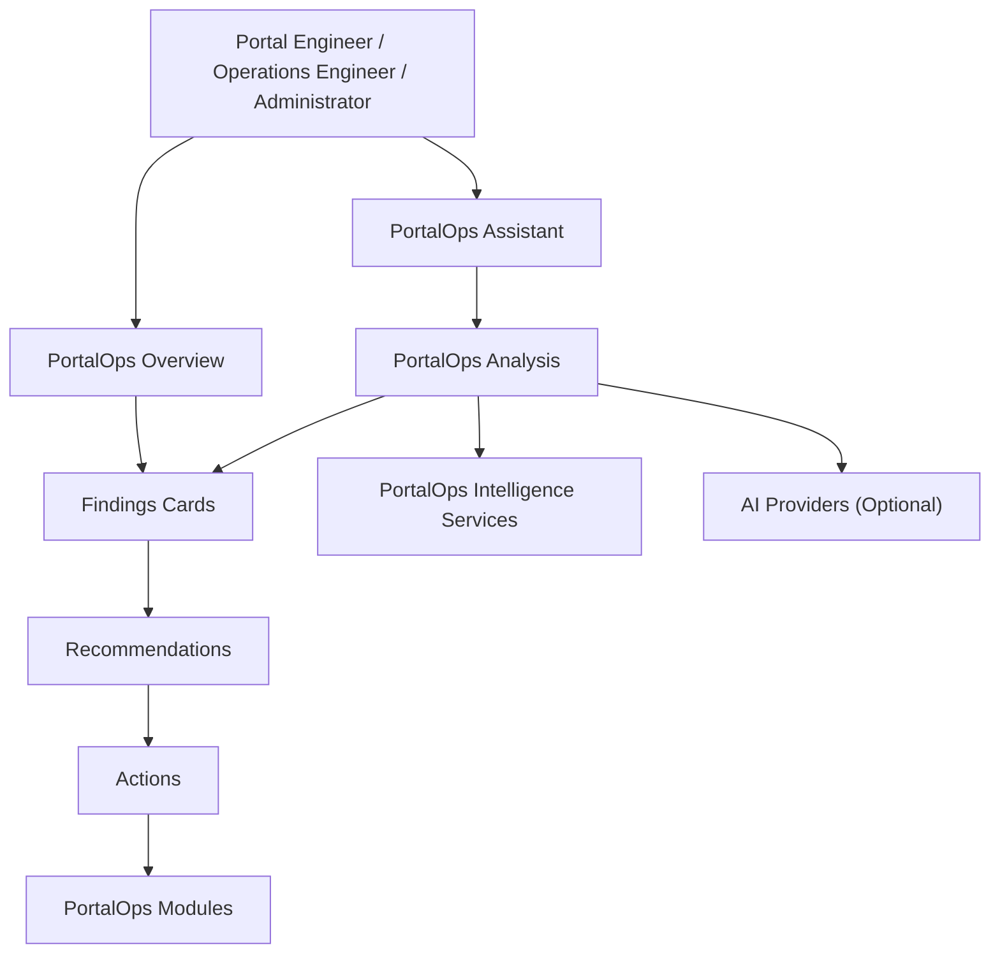

# PortalOps

An Operational Intelligence Platform for Liferay.

PortalOps provides operational intelligence, governance visibility, audit awareness, workflow insights, knowledge management, and AI-assisted analysis for Liferay environments.

PortalOps helps portal engineers identify issues, understand impact, and take action.

This repository is currently Liferay-first and built as a native Liferay `portal-7.4-ga132` modular workspace.

## PortalOps Principles

PortalOps is operations-first.

PortalOps optimizes for:

- Findings
- Risks
- Governance
- Operational investigations
- Recommendations
- Actions

PortalOps does not optimize for chat conversations.

## Product Direction

PortalOps is not a monitoring dashboard, a generic chatbot, or an AI chat assistant.

PortalOps is a modular operational intelligence platform with first-class product modules:

- Overview
- Assistant
- Knowledge
- Policy
- Content
- Workflow
- Audit
- System Health

Navigation remains first-class. The Assistant helps users investigate issues and navigate into the appropriate PortalOps module. It does not replace the rest of the product.

## Architecture



## Core Concepts

### Operational Intelligence

PortalOps treats operational work as investigations, not conversations.

Typical PortalOps questions include:

- Analyze portal health
- Show stale content
- Review permission risks
- Analyze search health
- Explain failed workflows
- Show recent changes

PortalOps should answer:

1. What did I find?
2. Why does it matter?
3. What should I do next?

Detailed narrative explanation is secondary.

### Response Model

PortalOps responses are built from:

1. Summary
2. Findings Cards
3. Recommendations
4. Actions

Cards are reusable response primitives, not page-specific widgets.

Examples:

- `SearchFailureCard`
- `StaleContentCard`
- `PermissionRiskCard`
- `WorkflowFailureCard`
- `ConfigurationDriftCard`
- `PolicyViolationCard`

These response components can be reused across:

- Overview
- Assistant
- Reports
- Notifications

### AI Provider Strategy

PortalOps owns the user experience:

- Response structure
- Card taxonomy
- Recommendations
- Actions
- Navigation semantics

AI providers only supply analysis, correlation, summarization, and recommendations through a PortalOps-owned contract.

Current provider direction:

- `portalops-ai-api`
- `portalops-ai-openai`

Future provider bundles can include:

- `portalops-ai-claude`
- `portalops-ai-ollama`
- `portalops-ai-gemini`
- `portalops-ai-oip`

## Module Layout

The current module set is organized under [modules](modules):

- `portalops-api`: shared interfaces, DTOs, knowledge models, and core contracts
- `portalops-assistant-api`: deterministic assistant request and response contracts
- `portalops-assistant-service`: assistant command routing and handler execution
- `portalops-ai-api`: provider-independent analysis contracts
- `portalops-ai-openai`: initial OpenAI provider bundle scaffold
- `portalops-audit`: audit event contracts and recording abstraction
- `portalops-command`: existing command parsing and routing layer
- `portalops-content`: content intelligence capability area
- `portalops-knowledge`: structured portal knowledge aggregation
- `portalops-llm-spi`: legacy provider abstraction area under transition
- `portalops-permissions`: permissions and governance capability area
- `portalops-policy`: authorization and guardrail abstractions
- `portalops-service`: orchestration facade
- `portalops-site`: site intelligence capability area
- `portalops-web`: Liferay MVC module for Overview, Assistant, and product UI
- `portalops-workflow`: workflow intelligence capability area

## Repo Structure

```text
.
├── configs/
├── docs/
│   ├── architecture/
│   └── ROADMAP.md
├── modules/
│   ├── portalops-ai-api/
│   ├── portalops-ai-openai/
│   ├── portalops-api/
│   ├── portalops-assistant-api/
│   ├── portalops-assistant-service/
│   ├── portalops-audit/
│   ├── portalops-command/
│   ├── portalops-content/
│   ├── portalops-knowledge/
│   ├── portalops-llm-spi/
│   ├── portalops-permissions/
│   ├── portalops-policy/
│   ├── portalops-service/
│   ├── portalops-site/
│   ├── portalops-web/
│   └── portalops-workflow/
├── client-extensions/
├── bundles/
└── themes/
```

## Getting Started

### Prerequisites

- Java 21
- Blade CLI
- A local Liferay bundle initialized in this workspace

### First Run

Initialize the bundle if needed:

```bash
blade gw initBundle
```

Start Liferay locally:

```bash
blade server start -t
```

Deploy workspace modules:

```bash
blade gw deploy
```

Once startup completes, access Liferay at `http://localhost:8080`.

Default local credentials:

- `test@liferay.com`
- `test`

## OSGi Shell Console

This workspace is configured to expose the OSGi shell console on `localhost:11311`.

Connect with:

```bash
nc localhost 11311
```

Useful first commands:

```text
lb
scr:list
help
```

You can also use Blade shell helpers such as:

```bash
blade sh lb
```

## Documentation

Architecture docs:

- [Assistant Architecture](docs/architecture/assistant-architecture.md)
- [Response Model](docs/architecture/response-model.md)
- [AI Provider Architecture](docs/architecture/ai-provider-architecture.md)
- [Operational Intelligence Philosophy](docs/architecture/operational-intelligence.md)

## Status

Current maturity: Liferay-first prototype evolving into an operational intelligence platform with:

- intelligence-first Overview design
- dedicated Assistant module direction
- deterministic assistant command execution foundation
- provider-independent analysis contracts
- modular capability areas for content, workflow, governance, audit, and system health
