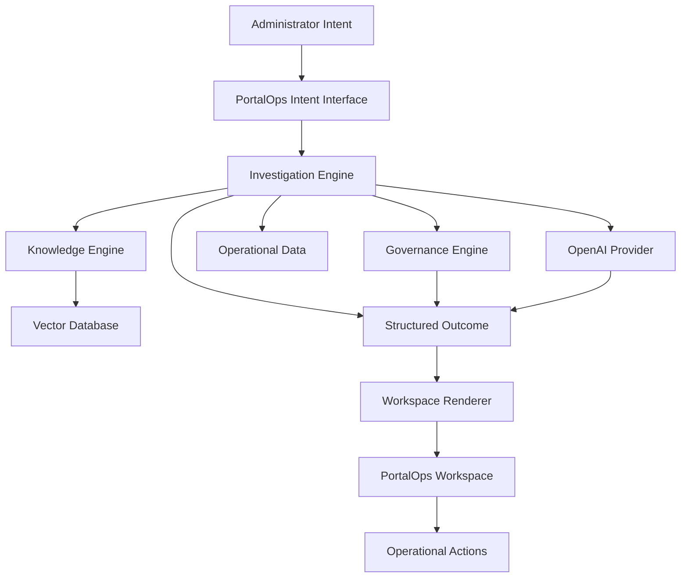

# PortalOps

An AI-native Operational Intelligence Platform for Liferay.

PortalOps combines portal knowledge, governance, operational data, reasoning, and actions into a unified administrative workspace. Instead of forcing administrators to navigate scattered menus, reports, and configuration screens, PortalOps lets them express intent and then investigates, analyzes, and presents the relevant findings, workspaces, and actions.

This repository is currently Liferay-first and built as a native Liferay `portal-7.4-ga132` modular workspace.

## Vision

PortalOps is not a chatbot and not a traditional administration dashboard.

PortalOps is an operational intelligence platform that helps portal engineers, operations engineers, platform owners, administrators, and support teams understand what matters, why it matters, and what to do next.

The core operating model is:

```text
Intent -> Investigation -> Findings -> Workspace -> Actions
```

## Core Principles

### Intent-Driven Administration

Traditional portals require administrators to navigate multiple screens, reports, and configuration areas.

PortalOps introduces an intent-driven model where users describe what they want to understand or accomplish.

Examples:

- Show users with excessive permissions
- Review workflow health
- Find stale content
- Analyze search failures
- Review inactive users

PortalOps determines the appropriate investigation and presents the relevant operational information.

### Operational Intelligence

PortalOps combines:

- Portal Knowledge
- Governance Rules
- Operational Data
- AI Reasoning
- Workspace Rendering
- Actions

The goal is not to provide answers alone, but to support operational decision making.

### Structured Outcomes

PortalOps does not rely solely on text responses.

Investigations produce structured outcomes that may include:

- Summary
- Findings
- Recommendations
- Actions
- Workspace Components

These outcomes are rendered within the PortalOps workspace.

### Governance First

PortalOps respects organizational governance.

Recommendations and actions are evaluated against:

- Security policies
- Portal governance rules
- Operational procedures
- Organizational standards

Governance remains authoritative over AI recommendations.

## Architecture



## PortalOps Modules

PortalOps remains a modular platform with first-class navigation.

Current product modules:

- Overview
- Assistant
- Knowledge
- Policy
- Content
- Workflow
- Audit
- System Health

The Assistant does not replace these modules. It helps users discover issues, launch investigations, and navigate into the appropriate operational workspace.

## Workspace Model

PortalOps renders investigation outcomes within a workspace rather than relying only on conversational output.

Potential workspace components include:

- Cards
- Tables
- Trees
- Forms
- Charts
- Findings
- Actions

AI does not generate user interfaces directly. AI and investigation services produce structured outcomes that the PortalOps renderer converts into operational user experiences.

## Knowledge Layer

PortalOps knowledge sources may include:

- Liferay Documentation
- Internal Runbooks
- Operational Procedures
- Governance Policies
- Portal Administration Guides
- Knowledge Base Articles

Knowledge is intended to be indexed into a vector database for retrieval and analysis.

## Investigations

PortalOps translates user intent into operational investigations such as:

- Role Governance Investigation
- Content Governance Investigation
- Workflow Investigation
- Search Investigation
- Audit Investigation
- System Health Investigation

Investigations produce structured outcomes rather than free-form answers.

## Skills and Tools

PortalOps introduces domain-specific skills that may orchestrate tools and APIs.

Example skills:

- Portal Administration Skill
- Role Governance Skill
- Workflow Analysis Skill
- Search Analysis Skill
- Content Governance Skill
- Audit Skill

Example tools:

- User APIs
- Role APIs
- Permission APIs
- Workflow APIs
- Search APIs
- Content APIs

Skills orchestrate tools and generate structured outcomes for the PortalOps workspace.

## AI Provider Strategy

PortalOps owns the operational experience:

- Intent handling
- Investigation structure
- Response structure
- Workspace components
- Recommendations
- Actions
- Navigation semantics

AI providers contribute:

- Reasoning
- Correlation
- Summarization
- Retrieval-assisted analysis

Current provider direction:

- `portalops-ai-api`
- `portalops-ai-openai`

Planned supporting infrastructure includes:

- OpenAI provider integration
- Vector database for knowledge retrieval
- Knowledge engine and governance engine composition

Future providers can be added as separate OSGi bundles without changing the PortalOps experience.

## Module Layout

The current module set is organized under [modules](modules):

- `portalops-api`: shared interfaces, DTOs, knowledge models, and core contracts
- `portalops-assistant-api`: assistant request and response contracts
- `portalops-assistant-service`: assistant routing and handler execution
- `portalops-ai-api`: provider-independent analysis contracts
- `portalops-ai-openai`: initial OpenAI provider bundle scaffold
- `portalops-audit`: audit event contracts and recording abstraction
- `portalops-command`: command parsing and routing layer under evolution
- `portalops-content`: content intelligence capability area
- `portalops-knowledge`: structured portal knowledge aggregation
- `portalops-llm-spi`: legacy provider abstraction area under transition
- `portalops-permissions`: permissions and governance capability area
- `portalops-policy`: authorization and guardrail abstractions
- `portalops-service`: orchestration facade
- `portalops-site`: site intelligence capability area
- `portalops-web`: Liferay MVC module for the PortalOps workspace
- `portalops-workflow`: workflow intelligence capability area

## Repo Structure

```text
.
├── configs/
├── docs/
│   ├── architecture/
│   └── ROADMAP.md
├── modules/
│   ├── portalops-ai-api/
│   ├── portalops-ai-openai/
│   ├── portalops-api/
│   ├── portalops-assistant-api/
│   ├── portalops-assistant-service/
│   ├── portalops-audit/
│   ├── portalops-command/
│   ├── portalops-content/
│   ├── portalops-knowledge/
│   ├── portalops-llm-spi/
│   ├── portalops-permissions/
│   ├── portalops-policy/
│   ├── portalops-service/
│   ├── portalops-site/
│   ├── portalops-web/
│   └── portalops-workflow/
├── client-extensions/
├── bundles/
└── themes/
```

## Getting Started

### Prerequisites

- Java 21
- Blade CLI
- A local Liferay bundle initialized in this workspace

### First Run

Initialize the bundle if needed:

```bash
blade gw initBundle
```

Start Liferay locally:

```bash
blade server start -t
```

Deploy workspace modules:

```bash
blade gw deploy
```

Once startup completes, access Liferay at `http://localhost:8080`.

Default local credentials:

- `test@liferay.com`
- `test`

## OSGi Shell Console

This workspace is configured to expose the OSGi shell console on `localhost:11311`.

Connect with:

```bash
nc localhost 11311
```

Useful first commands:

```text
lb
scr:list
help
```

You can also use Blade shell helpers such as:

```bash
blade sh lb
```

## Documentation

Architecture docs:

- [Assistant Architecture](docs/architecture/assistant-architecture.md)
- [Response Model](docs/architecture/response-model.md)
- [AI Provider Architecture](docs/architecture/ai-provider-architecture.md)
- [Operational Intelligence](docs/architecture/operational-intelligence.md)
