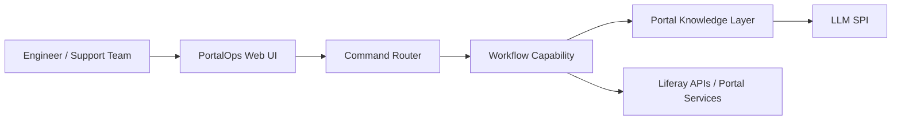

# PortalOps AI

AI-powered operations assistant for enterprise portals.

PortalOps AI helps engineering, support, and platform teams inspect, troubleshoot, and operate enterprise portal platforms through platform-aware workflows, structured portal knowledge, and guided operational tooling.

This repository is currently Liferay-first and built as a native Liferay 7.4 modular workspace. The long-term product direction is extensibility to other digital experience platforms such as AEM, WordPress, and similar systems.

## Architecture



## Features

- Platform-aware operational assistance for enterprise portals
- Liferay 7.4 native modular architecture using OSGi bundles
- Command-driven operational workflows
- Structured portal knowledge snapshots
- Workflow inspection as the first implemented MVP capability
- Thin MVC portlet shell for operator interaction
- Extensible AI provider boundary through SPI contracts
- Clear separation between UI, orchestration, capability, and knowledge layers

## MVP

Current MVP focus:

- Liferay-first implementation
- Core modular platform skeleton
- Workflow inspection vertical slice
- Read-only operational commands
- Portal knowledge aggregation for workflow data
- Thin web console for triggering supported commands

Currently implemented command:

- `/show workflows pending`

Current constraints:

- Read-only only
- No destructive admin actions
- No provider SDK integrations yet
- No vector database or persistence layer yet
- No Spring Boot backend in this workspace

## Module Layout

The current module set is organized under [modules](modules):

- `portalops-api`: shared interfaces, DTOs, command models, and knowledge models
- `portalops-command`: command parsing, intent routing, and handler dispatch
- `portalops-policy`: authorization and guardrail abstractions
- `portalops-audit`: audit event contracts and recording abstraction
- `portalops-service`: orchestration facade
- `portalops-web`: thin MVC portlet shell
- `portalops-knowledge`: structured portal knowledge aggregation
- `portalops-llm-spi`: AI provider abstraction only
- `portalops-workflow`: read-only workflow inspection capability
- `portalops-permissions`: placeholder capability module
- `portalops-content`: placeholder capability module
- `portalops-site`: placeholder capability module

## Repo Structure

```text
.
├── configs/
├── modules/
│   ├── portalops-api/
│   ├── portalops-audit/
│   ├── portalops-command/
│   ├── portalops-content/
│   ├── portalops-knowledge/
│   ├── portalops-llm-spi/
│   ├── portalops-permissions/
│   ├── portalops-policy/
│   ├── portalops-service/
│   ├── portalops-site/
│   ├── portalops-web/
│   └── portalops-workflow/
├── client-extensions/
├── bundles/
└── themes/
```

## Getting Started

### Prerequisites

- Java 21
- Blade CLI
- A local Liferay bundle initialized in this workspace

### First Run

Initialize the bundle if needed:

```bash
blade gw initBundle
```

Start Liferay locally:

```bash
blade server start -t
```

Deploy workspace modules:

```bash
blade gw deploy
```

Once startup completes, access Liferay at `http://localhost:8080`.

Default local credentials:

- `test@liferay.com`
- `test`

## OSGi Shell Console

This workspace is configured to expose the OSGi shell console on `localhost:11311`.

Connect with:

```bash
nc localhost 11311
```

Useful first commands:

```text
lb
scr:list
help
```

You can also use Blade shell helpers such as:

```bash
blade sh lb
```

## Current Vertical Slice

The first working end-to-end slice is workflow inspection for:

- `/show workflows pending`

This slice runs through:

1. MVC portlet UI
2. command parsing and routing
3. workflow inspection service
4. knowledge aggregation
5. structured result rendering

The implementation uses supported Liferay workflow services including `WorkflowTaskManager`, `WorkflowInstanceManager`, `UserLocalService`, `RoleLocalService`, and `GroupLocalService`.

## Roadmap

### Phase 0

- Core platform skeleton
- Modular contracts and orchestration
- Thin Liferay-native UI shell

### Phase 1

- Liferay-first workflow inspection
- Structured portal knowledge for workflow data
- First operational command vertical slice

### Phase 2

- AI command console improvements
- Knowledge-aware explanations and summarization through SPI providers
- Additional read-only operational capabilities

### Phase 3

- Permissions governance
- Content governance
- Site diagnostics and anomaly detection

### Phase 4

- Expanded platform adapters
- Cross-platform portal operations model
- Enterprise multi-platform PortalOps direction

## Positioning

PortalOps AI is not a generic chatbot.

It is an enterprise portal operations product focused on:

- workflow visibility
- permissions governance
- content hygiene
- site intelligence
- operational diagnostics
- guided administrative actions

## Status

Current maturity: prototype with a working Liferay-first MVP slice and a clear modular architecture for expansion.