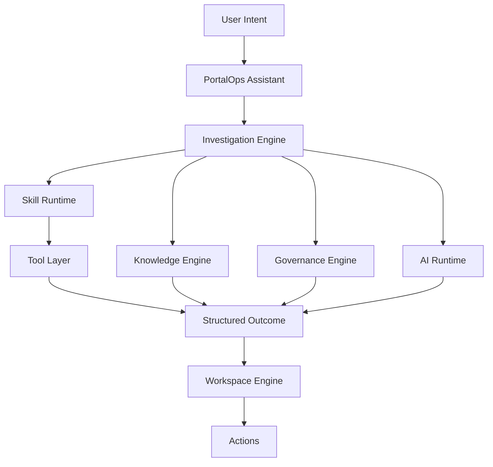

# PortalOps

PortalOps is an AI-native operational intelligence platform for enterprise portals, starting with Liferay.

PortalOps combines portal knowledge, governance, operational data, reasoning, skills, tools, structured outcomes, and workspace rendering into a unified administrative experience. Users express intent, PortalOps performs investigations, gathers evidence, applies governance, and presents findings, actions, and operational workspaces.

This repository is currently Liferay-first and built as a native Liferay `portal-7.4-ga132` modular workspace.

## Core Model

```text
Intent -> Investigation -> Findings -> Workspace -> Actions
```

PortalOps is not a chatbot and not a traditional administration dashboard.

The assistant is the primary interaction model.

The dashboard is a supporting view.

## What PortalOps Is

PortalOps is:

- An intent-driven operational intelligence platform
- A governance-aware administrative workspace
- A skills-and-tools orchestration layer for portal investigations
- A renderer of structured operational outcomes
- A modular Liferay application built from multiple OSGi capability bundles

PortalOps is not:

- A generic AI chatbot
- A dashboard-only product
- A text-only assistant
- A monolithic admin application

## Architectural Principles

### Intent Driven

Users describe what they want to understand or accomplish.

Examples:

- Review workflow health
- Find users with excessive permissions
- Analyze search failures
- Review stale content
- Audit role assignments

PortalOps resolves that intent into an investigation path.

### Structured Outcomes

AI does not generate UI directly.

AI and investigation services produce structured outcomes such as:

- Summary
- Findings
- Recommendations
- Actions
- Workspace Components

PortalOps renders those outcomes through its workspace engine.

### Governance First

Governance is a first-class capability.

PortalOps recommendations must be evaluated against:

- Security Policies
- Governance Rules
- Portal Standards
- Organizational Policies

Governance is authoritative over AI recommendations.

### Knowledge Centric

PortalOps maintains portal-specific knowledge such as:

- Liferay Documentation
- Portal Administration Guides
- Governance Policies
- Runbooks
- Operational Procedures
- Internal Knowledge Base

Knowledge is expected to be stored in a vector database and retrieved during investigations.

## Platform Architecture



## Modular Liferay Direction

PortalOps should favor multiple Liferay OSGi intelligence modules rather than a single monolithic application.

Core platform modules may include:

- `portalops-core`
- `portalops-knowledge`
- `portalops-governance`
- `portalops-agent-runtime`
- `portalops-skill-runtime`
- `portalops-workspace-engine`

Intelligence modules may include:

- `portalops-user-intelligence`
- `portalops-role-intelligence`
- `portalops-content-intelligence`
- `portalops-workflow-intelligence`
- `portalops-search-intelligence`
- `portalops-audit-intelligence`
- `portalops-system-health-intelligence`

Each intelligence module may contribute:

- Knowledge
- Governance Rules
- Skills
- Tools
- Workspace Components

## Current MVP Direction

Current documentation direction assumes:

- OpenAI as the first AI provider
- ChromaDB as the first vector database
- Assistant-first interaction
- Structured outcomes rendered into PortalOps workspaces
- Governance-aware investigations over raw text responses

## Documentation

Start here:

- [Vision](docs/vision.md)
- [Architecture](docs/architecture.md)
- [AI Architecture](docs/ai-architecture.md)
- [Workspace Model](docs/workspace-model.md)
- [Skills and Tools](docs/skills-and-tools.md)
- [Roadmap](docs/roadmap.md)

Supporting architecture notes:

- [Assistant Architecture](docs/architecture/assistant-architecture.md)
- [Response Model](docs/architecture/response-model.md)
- [AI Provider Architecture](docs/architecture/ai-provider-architecture.md)
- [Operational Intelligence](docs/architecture/operational-intelligence.md)
