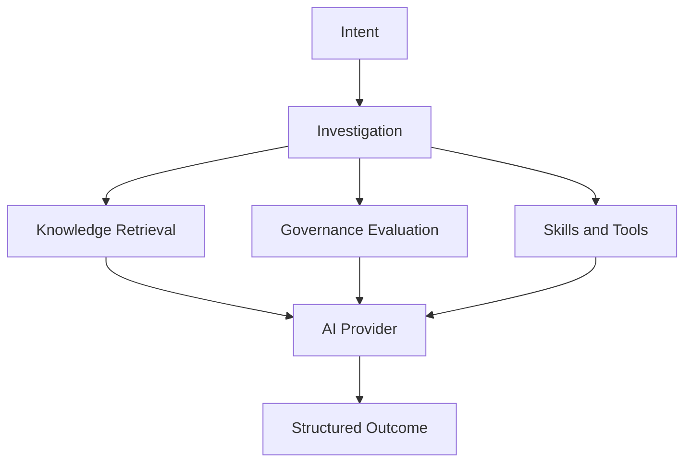

# PortalOps AI Architecture

PortalOps uses AI as part of a larger operational intelligence runtime.

AI is not the product by itself. AI participates in investigations and helps produce structured outcomes that PortalOps renders.

## AI Role

AI contributes:

- Reasoning
- Summarization
- Correlation
- Retrieval-assisted analysis
- Explanation of evidence

AI does not own:

- UI generation
- Governance authority
- Workspace rendering
- Navigation semantics

## AI Flow



## Current MVP Direction

Current direction:

- AI Provider: OpenAI
- Vector Database: ChromaDB

Knowledge is expected to be stored in the vector database and retrieved as part of investigations.

## Knowledge Sources

Initial knowledge sources may include:

- Liferay Documentation
- Portal Administration Guides
- Governance Policies
- Runbooks
- Operational Procedures
- Internal Knowledge Base

## Provider Independence

PortalOps should preserve provider independence.

AI providers may change over time, but the PortalOps model remains stable:

```text
Intent -> Investigation -> Findings -> Workspace -> Actions
```

The provider should not dictate the user experience.
