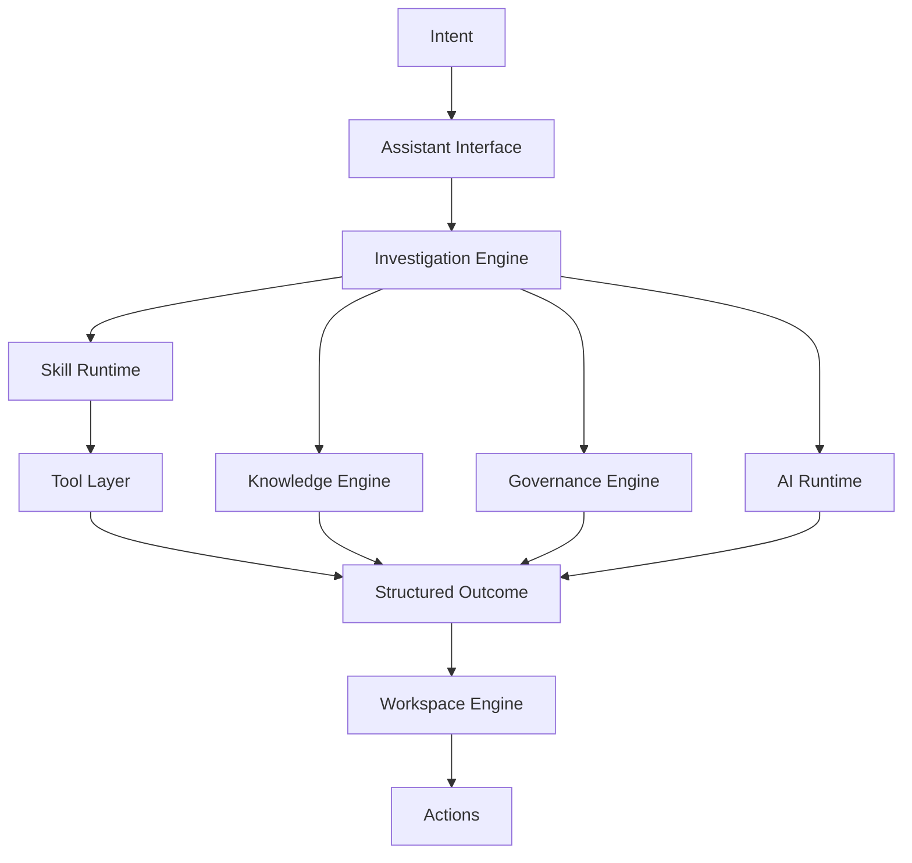

# PortalOps Architecture

PortalOps is designed as an AI-native operational intelligence platform composed of modular Liferay OSGi capabilities.

The architecture is centered on intent resolution, investigations, structured outcomes, and workspace rendering.

## End-to-End Flow

## Architectural Layers

### Interaction Layer

Primary entry points:

- Assistant
- Findings surfaces
- Supporting overview/dashboard views

This layer captures user intent and starts investigations.

### Investigation Layer

The investigation layer determines what evidence, skills, tools, knowledge, and governance policies are needed to fulfill the request.

Examples:

- Workflow health investigation
- Role governance investigation
- Search failure investigation
- Content staleness investigation

### Knowledge Layer

PortalOps maintains domain-specific knowledge that supports investigations and reasoning.

Knowledge sources may include:

- Liferay Documentation
- Portal Administration Guides
- Governance Policies
- Runbooks
- Operational Procedures
- Internal Knowledge Base

### Governance Layer

Governance is first-class.

This layer evaluates recommendations and actions against:

- Security Policies
- Governance Rules
- Portal Standards
- Organizational Policies

### Skills and Tools Layer

Skills are domain behaviors that orchestrate tools.

Tools connect to platform APIs and operational systems.

### AI Runtime

The AI runtime contributes reasoning, summarization, correlation, and retrieval-assisted analysis. It does not own the PortalOps user experience.

### Workspace Layer

The workspace layer renders structured outcomes into operational UI components such as:

- Cards
- Tables
- Trees
- Forms
- Charts
- Findings
- Actions

## Modular Liferay Direction

PortalOps should favor multiple OSGi modules instead of a monolith.

Potential platform modules:

- `portalops-core`
- `portalops-knowledge`
- `portalops-governance`
- `portalops-agent-runtime`
- `portalops-skill-runtime`
- `portalops-workspace-engine`

Potential intelligence modules:

- `portalops-user-intelligence`
- `portalops-role-intelligence`
- `portalops-content-intelligence`
- `portalops-workflow-intelligence`
- `portalops-search-intelligence`
- `portalops-audit-intelligence`
- `portalops-system-health-intelligence`

Each intelligence module may contribute:

- Knowledge
- Governance Rules
- Skills
- Tools
- Workspace Components

## Current Direction

Current MVP assumptions:

- OpenAI as the initial AI provider
- ChromaDB as the initial vector database
- Assistant-first workflow
- Structured outcomes instead of text-only responses
- Dashboard as a supporting surface, not the product center
