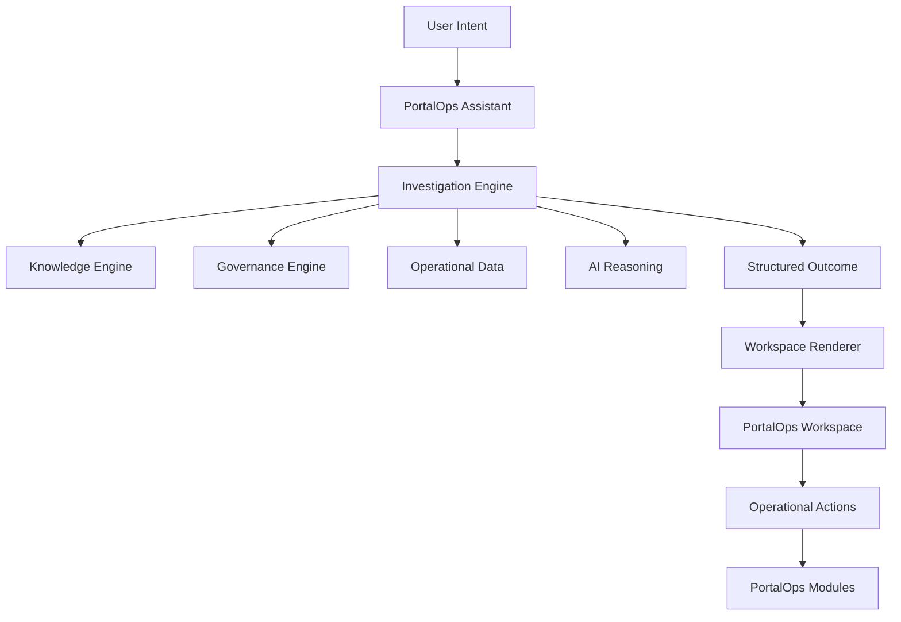

# Assistant Architecture

PortalOps Assistant is an intent interface for operational investigations.

It is not a chatbot, not a conversational product, and not a replacement for PortalOps modules. It is the entry point for intent-driven administration within the PortalOps workspace.

## Product Role

PortalOps Assistant helps users express what they want to understand or accomplish.

Examples:

- Show users with excessive permissions
- Review workflow health
- Find stale content
- Analyze search failures
- Review inactive users

The Assistant does not stop at text generation. It triggers investigations, gathers knowledge and operational context, and returns structured operational outcomes.

## PortalOps Modules

PortalOps remains a modular platform with first-class navigation.

Modules:

- Overview
- Assistant
- Knowledge
- Policy
- Content
- Workflow
- Audit
- System Health

Navigation remains first-class. The Assistant helps users discover issues, launch investigations, and route to the appropriate operational workspace.

## Assistant Flow

## Design Rules

- Assistant is intent-driven, not conversation-driven.
- Assistant initiates investigations rather than replacing application workflows.
- Assistant returns structured outcomes, not just paragraphs.
- Findings, actions, and workspace components come before detailed narrative.
- Governance remains authoritative over AI-generated recommendations.
- PortalOps modules remain first-class operational destinations.

## Transitional UI State

The current right-rail assistant is a transitional surface for validating the interaction model.

The long-term direction is a dedicated Assistant workspace capable of rendering:

- Summary
- Findings
- Recommendations
- Actions
- Tables
- Forms
- Trees
- Charts

The assistant should evolve into an investigation work surface, not a generic chat pane.
