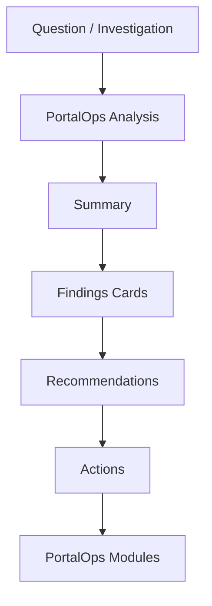

# Assistant Architecture

PortalOps Assistant is an operational analysis interface for Liferay.

It is not a chatbot, not a conversational product, and not a replacement for PortalOps modules.

The Assistant helps users investigate issues, understand impact, and navigate into the right operational workflow.

## PortalOps Modules

PortalOps remains a modular platform with first-class navigation.

Modules:

- Overview
- Assistant
- Knowledge
- Policy
- Content
- Workflow
- Audit
- System Health

Navigation remains first-class. The Assistant helps users discover issues and route to the appropriate module. It does not replace module navigation.

## Analysis Flow

## Role of the Assistant

The Assistant is an analysis surface.

It should support questions such as:

- Analyze portal health
- Show stale content
- Review permission risks
- Analyze search health
- Explain failed workflows
- Show recent changes

The Assistant should return structured operational responses rather than conversation threads.

## Design Rules

- Assistant is not a chatbot.
- Assistant is not a conversational product.
- Assistant is not a replacement for PortalOps modules.
- Assistant should help users investigate issues.
- Assistant should help users navigate to the correct PortalOps module.
- Findings cards should appear before detailed narrative text.
- Narrative explanation is optional and secondary.

## Transitional State

The current sidebar assistant can remain temporarily, but it should be treated as transitional.

The long-term direction is a dedicated Assistant module with sufficient room for:

- Findings
- Reusable cards
- Recommendations
- Actions
- Future AI-generated analysis
